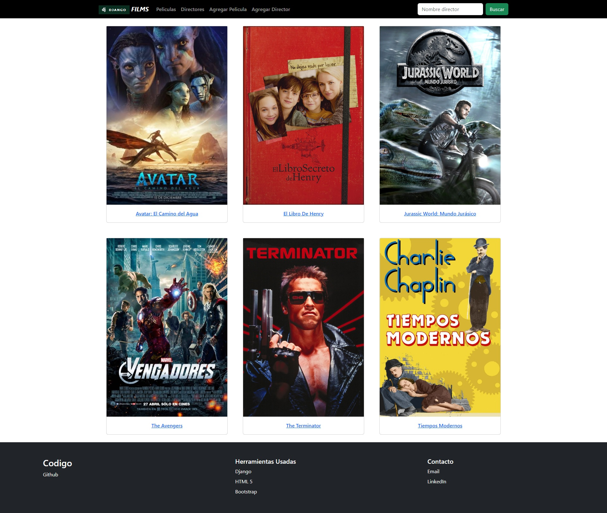

## 

    Welcome to my Github page! my name is <strong>Alberto</strong>. I am a Backend Developer with courses on digital platforms, eager to learn, positive thinking, focused on achievements.
   

### I’m currently learning: 

 

### Languages and Tools:

 
 

### Projects

### How to reach me: 

<!--
**tony21019/tony21019** is a ✨ _special_ ✨ repository because its `README.md` (this file) appears on your GitHub profile.

Here are some ideas to get you started:

- 🔭 I’m currently working on ...
- 🌱 I’m currently learning ...
- 👯 I’m looking to collaborate on ...
- 🤔 I’m looking for help with ...
- 💬 Ask me about ...
- 📫 How to reach me: ...
- 😄 Pronouns: ...
- ⚡ Fun fact: ...
-->
